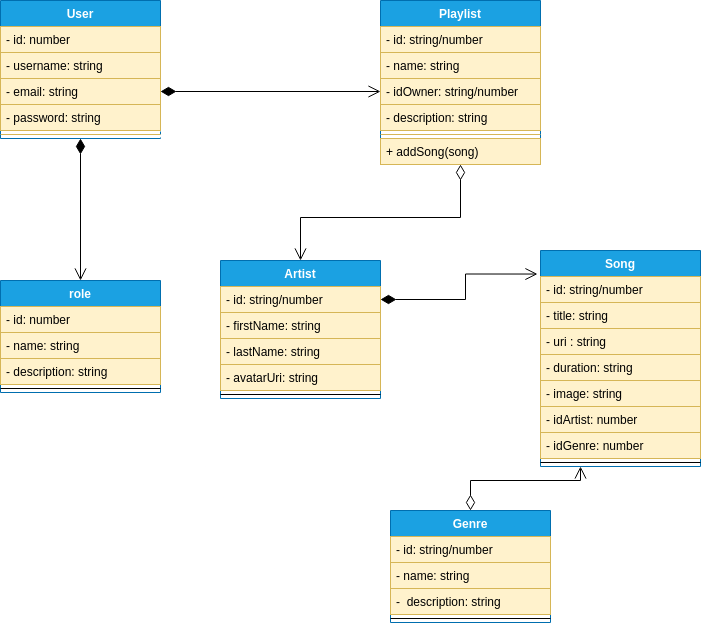

# Titulo: Spotplay

## Overview: 
Spotplay es una nueva compañía de música online que tiene como objetivo proporcionar mejores relaciones con los artistas y fans. 

Su producto es _Spotplay_, una plataforma en la que las personas pueden generar  listas de reproducción para sus artistas favoritos y gustos musicales. 

### Alcance
- La aplicación tendrá acceso para usuarios consumidores a través de su registro
- La aplicación tendrá acceso para usuarios editores para dar mantenimiento a la aplicación

### Casos de uso

* El usuario lector puede crear una nueva lista con un nombre dado
* El usuario lector puede obtener las listas de reproducción de los usuarios
* El usuario lector puede obtener una lista individual
* El usuario lector puede agregar canciones a una lista de la que sea dueño
* El usuario editor puede agregar nuevos artistas
* El usuario editor puede agregar nuevas canciones

### Out of Scope (casos de uso No Soportados)

* El usuario no puede acceder con cuentas de terceros (google, facebook)

---
## Arquitectura

### Diagramas

#### Diagrama de clases (UML)

#### Endpoints
Para todos los endpoints se la dirección base es `/api/v1` ej:
`http://localhost:3000/api/v1/user`

- Song

| **Endpoint** | **GET**   | **POST**      | **PUT**     | **DELETE**    |
|--------------|-----------|---------------|-------------|---------------|
| /song?genreId&artistId       | All songs | Create a song | -           | -             |
| /song/:id    | One song  | -             | Edit a song | Delete a song |

- Artist

| **Endpoint** | **GET**     | **POST**         | **PUT**     | **DELETE**    |
|--------------|-------------|------------------|-------------|---------------|
| /artist      | All artists | Create an artist | -           | -             |
| /artist/:id  | One artist  | -                | Edit artist | Delete artist |

- Genre

| **Endpoint** | **GET**    | **POST**       | **PUT**    | **DELETE**   |
|--------------|------------|----------------|------------|--------------|
| /genre       | All genres | Create a genre | -          | -            |
| /genre/:id   | One genre  | -              | Edit genre | Delete genre |

- Playlist

| **Endpoint** | **GET**    | **POST**       | **PUT**    | **DELETE**   |
|--------------|------------|----------------|------------|--------------|
| /playlist       | All playlists without songs | Create a playlist | -          | -            |
| /playlist/:id   | One playlist with songs | -              | Edit playlist | Delete playlist |

- User

| **Endpoint** | **GET**                     | **POST**      | **PUT**   | **DELETE**  |
|--------------|-----------------------------|---------------|-----------|-------------|
| /user/signup |                             | Create a user | -         | -           |
| /user        | All users without playlists |               | -         | -           |
| /user:id     | Get a user with playlists   | -             | Edit user | Delete user |

- Role

| **Endpoint** | **GET**    | **POST**      | **PUT**     | **DELETE**    |
|--------------|------------|---------------|-------------|---------------|
| /role        | All roles  | Create a role | -           | -             |
| /role/:id    | Get a role | -             | Edit a role | Delete a role |

### Modelo de datos
Poner diseño de entidades, Jsons, tablas, diagramas entidad relación, etc..

---
## Limitaciones
Lista de limitaciones conocidas. Puede ser en formato de lista.
Ej.
* Llamadas del API tienen latencia X
* No se soporta mas de X llamadas por segundo
---
## Costo
Descripción/Análisis de costos
Ejemplo:
"Considerando N usuarios diarios, M llamadas a X servicio/baseDatos/etc"
* 1000 llamadas diarias a serverless functions. $XX.XX
* 1000 read/write units diarias a X Database on-demand. $XX.XX
Total: $xx.xx (al mes/dia/año)